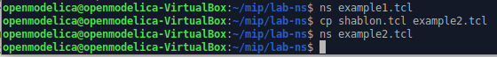

---
## Front matter
title: "Лабораторная работа №1"
subtitle: "Имитационное моделирование"
author: "Серёгина Ирина Андреевна"

## Generic otions
lang: ru-RU
toc-title: "Содержание"

## Bibliography
bibliography: bib/cite.bib
csl: pandoc/csl/gost-r-7-0-5-2008-numeric.csl

## Pdf output format
toc: true # Table of contents
toc-depth: 2
lof: true # List of figures
lot: true # List of tables
fontsize: 12pt
linestretch: 1.5
papersize: a4
documentclass: scrreprt
## I18n polyglossia
polyglossia-lang:
  name: russian
  options:
	- spelling=modern
	- babelshorthands=true
polyglossia-otherlangs:
  name: english
## I18n babel
babel-lang: russian
babel-otherlangs: english
## Fonts
mainfont: IBM Plex Serif
romanfont: IBM Plex Serif
sansfont: IBM Plex Sans
monofont: IBM Plex Mono
mathfont: STIX Two Math
mainfontoptions: Ligatures=Common,Ligatures=TeX,Scale=0.94
romanfontoptions: Ligatures=Common,Ligatures=TeX,Scale=0.94
sansfontoptions: Ligatures=Common,Ligatures=TeX,Scale=MatchLowercase,Scale=0.94
monofontoptions: Scale=MatchLowercase,Scale=0.94,FakeStretch=0.9
mathfontoptions:
## Biblatex
biblatex: true
biblio-style: "gost-numeric"
biblatexoptions:
  - parentracker=true
  - backend=biber
  - hyperref=auto
  - language=auto
  - autolang=other*
  - citestyle=gost-numeric
## Pandoc-crossref LaTeX customization
figureTitle: "Рис."
tableTitle: "Таблица"
listingTitle: "Листинг"
lofTitle: "Список иллюстраций"
lotTitle: "Список таблиц"
lolTitle: "Листинги"
## Misc options
indent: true
header-includes:
  - \usepackage{indentfirst}
  - \usepackage{float} # keep figures where there are in the text
  - \floatplacement{figure}{H} # keep figures where there are in the text
---

# Цель работы

Приобретение навыков моделирования сетей передачи данных с помощью средства имитационного моделирования NS-2, а также анализ полученных результатов моделирования.

# Задание

1. Создание шаблона сценария для NS-2.
2. Пример топологии сети, состоящей из двух узлов и одного соединения.
3. Пример усложненной топологии сети.
4. Пример кольцевой топологии сети.
5. Упражнение.

# Выполнение лабораторной работы

1. Создание шаблона сценария для NS-2.

Создаю директорию mip, где буду выполнять лабораторные работы. В ней создаю директорию lab-ns, а в ней файл shablon.tcl (рис. [-@fig:001]).

{#fig:001 width=70%}

После этого открываю файл shablon.tcl на редактирование и создаю симулятор. Затем создадим переменную nf и укажем, что требуется открыть на запись nam-файл
для регистрации выходных результатов моделирования. Вторая строка даёт команду симулятору записывать все данные о динамике модели в файл out.nam.
Далее создадим переменную f и откроем на запись файл трассировки для регистрации всех событий модели. 
После этого добавим процедуру finish, которая закрывает файлы трассировки и запускает nam. С помощью команды at указываем планировщику событий, что процедуру finish следует запустить через 5 с после начала моделирования, после чего
запустить симулятор ns. (рис. [-@fig:002]).

{#fig:002 width=70%}

Сохранив изменения в отредактированном файле shablon.tcl и закрыв его,
можно запустить симулятор командой ns shablon.tcl, при этом на экране появится сообщение типа nam: empty trace file out.nam поскольку ещё не определены никакие объекты и действия. По этой же причине наша область моделирования
будет пустой (рис. [-@fig:003]).

{#fig:003 width=70%}

2. Простой пример описания топологии сети, состоящей из двух узлов и одного соединения

Постановка задачи. Требуется смоделировать сеть передачи данных, состоящую
из двух узлов, соединённых дуплексной линией связи с полосой пропускания 2
Мб/с и задержкой 10 мс, очередью с обслуживанием типа DropTail. От одного узла
к другому по протоколу UDP осуществляется передача пакетов, размером 500 байт,
с постоянной скоростью 200 пакетов в секунду.

Для начала я копирую содержимое файла shablon.tcl в файл example1.tcl и в дальнейшем все изменения буду вставлять перед строчкой $ns at 5.0 "finish" (рис. [-@fig:004]).

{#fig:004 width=70%}

Создадим агенты для генерации и приёма трафика.
Создаётся агент UDP и присоединяется к узлу n0. В узле агент сам не может
генерировать трафик, он лишь реализует протоколы и алгоритмы транспортного
уровня. Поэтому к агенту присоединяется приложение. В данном случае — это
источник с постоянной скоростью (Constant Bit Rate, CBR), который каждые 5 мс
посылает пакет R = 500 байт. Таким образом, скорость источника: R = 500 · 8/0, 005 = 800000 бит/с.
Далее создадим Null-агент, который работает как приёмник трафика, и прикрепим
его к узлу n1. Соединим агенты между собой. Для запуска и остановки приложения CBR добавляются at-события в планировщик
событий (перед командой $ns at 5.0 "finish") (рис. [-@fig:005]).

{#fig:005 width=70%}
 
Сохранив изменения в отредактированном файле и запустив симулятор получим в качестве результата запуск аниматора nam в фоновом режиме.
При нажатии на кнопку play в окне nam через 0.5 секунды из узла 0 данные начнут
поступать к узлу 1. Это процесс можно замедлить, выбирая шаг отображения в nam.
Можно осуществлять наблюдение за отдельным пакетом, щёлкнув по нему в окне
nam, а щёлкнув по соединению, можно получить о нем некоторую информацию. (рис. [-@fig:006]).

{#fig:006 width=70%}

3. Пример с усложненной топологией сети

Описание моделируемой сети :
– сеть состоит из 4 узлов (n0, n1, n2, n3);
– между узлами n0 и n2, n1 и n2 установлено дуплексное соединение с пропускной
способностью 2 Мбит/с и задержкой 10 мс;
– между узлами n2 и n3 установлено дуплексное соединение с пропускной способ-
ностью 1,7 Мбит/с и задержкой 20 мс;
– каждый узел использует очередь с дисциплиной DropTail для накопления пакетов,
максимальный размер которой составляет 10;
– TCP-источник на узле n0 подключается к TCP-приёмнику на узле n3
(по-умолчанию, максимальный размер пакета, который TCP-агент может генери-
ровать, равняется 1KByte)
– TCP-приёмник генерирует и отправляет ACK пакеты отправителю и откидывает
полученные пакеты;
– UDP-агент, который подсоединён к узлу n1, подключён к null-агенту на узле n3
(null-агент просто откидывает пакеты);
– генераторы трафика ftp и cbr прикреплены к TCP и UDP агентам соответственно;
– генератор cbr генерирует пакеты размером 1 Кбайт со скоростью 1 Мбит/с;
– работа cbr начинается в 0,1 секунду и прекращается в 4,5 секунды, а ftp начинает
работать в 1,0 секунду и прекращает в 4,0 секунды.

Скопируем содержимое созданного шаблона в новый файл cp shablon.tcl example2.tcl и откроем example2.tcl на редактирование (рис. [-@fig:007]).

{#fig:007 width=70%} 

Создадим 4 узла и 3 дуплексных соединения с указанием направления (рис. [-@fig:008]).

{#fig:008 width=70%} 

Создадим агент UDP с прикреплённым к нему источником CBR и агент TCP с прикреплённым к нему приложением FTP (рис. [-@fig:009]).

{#fig:009 width=70%} 

Создадим агенты-получатели, соединим агенты udp0 и tcp1 и их получателей, зададим описание цвета каждого потока, отслеживание событий в очереди, наложим ограничения на размер очереди и добавим at-события (рис. [-@fig:010]).

{#fig:010 width=70%} 

Сохранив изменения в отредактированном файле и запустив симулятор, получим анимированный результат моделирования. 
При запуске скрипта можно заметить, что по соединениям между узлами n(0)–n(2)
и n(1)–n(2) к узлу n(2) передаётся данных больше, чем способно передаваться по
соединению от узла n(2) к узлу n(3). Действительно, мы передаём 200 пакетов
в секунду от каждого источника данных в узлах n(0) и n(1), а каждый пакет имеет
размер 500 байт. Таким образом, полоса каждого соединения 0, 8 Mb, а суммарная
— 1, 6 Mb. Но соединение n(2)–n(3) имеет полосу лишь 1 Mb. Следовательно, часть
пакетов должна теряться. В окне аниматора можно видеть пакеты в очереди, а также
те пакеты, которые отбрасываются при переполнении (рис. [-@fig:011]).

{#fig:011 width=70%} 

4. Пример с кольцевой топологией сети

Постановка задачи. Требуется построить модель передачи данных по сети с кольцевой топологией и динамической маршрутизацией пакетов:
– сеть состоит из 7 узлов, соединённых в кольцо;
– данные передаются от узла n(0) к узлу n(3) по кратчайшему пути;
– с 1 по 2 секунду модельного времени происходит разрыв соединения между
узлами n(1) и n(2);
– при разрыве соединения маршрут передачи данных должен измениться на резервный.

Cкопируем содержимое созданного шаблона в новый файл и откроем example3.tcl на редактирование (рис. [-@fig:012]).

{#fig:012 width=70%} 

Опишем топологию моделируемой сети, далее соединим узлы так, чтобы создать круговую топологию.
Каждый узел, за исключением последнего, соединяется со следующим, последний
соединяется с первым. Для этого в цикле использован оператор %, означающий
остаток от деления нацело.
Зададим передачу данных от узла n(0) к узлу n(3).
Данные передаются по кратчайшему маршруту от узла n(0) к узлу n(3), через узлы
n(1) и n(2) (
Добавим команду разрыва соединения между узлами n(1) и n(2) на время в одну
секунду, а также время начала и окончания передачи данных. (рис. [-@fig:013]).

{#fig:013 width=70%} 

Передача данных при кольцевой топологии сети в случае разрыва соединения
представлена на рисунке ниже (рис. [-@fig:014]).

{#fig:014 width=70%} 

5. Выполнение упражнения

Необходимо внести следующие изменения в реализацию кольцевой топологии сети:
– передача данных должна осуществляться от узла n(0) до узла n(5) по кратчайшему пути в течение 5 секунд модельного времени;
– передача данных должна идти по протоколу TCP (тип Newreno), на принимающей стороне используется TCPSink-объект типа DelAck; поверх TCP работает
протокол FTP с 0,5 до 4,5 секунд модельного времени;
– с 1 по 2 секунду модельного времени происходит разрыв соединения между
узлами n(0) и n(1);
– при разрыве соединения маршрут передачи данных должен измениться на резервный, после восстановления соединения пакеты снова должны пойти по
кратчайшему пути.

Для начала я скопировал содержимое файла example3.tcl в новый файл example4.tcl и открыла его для редактирования (рис. [-@fig:015]).

{#fig:015 width=70%} 

После этого поменяла файл таким образом, что данная модели соответствовала всем требованиям. указанным выше (рис. [-@fig:016]).

{#fig:016 width=70%} 

Построенная модель соответствует требованиям и выглядит так же, как и требовалось в инструкции (рис. [-@fig:017]).

{#fig:017 width=70%} 

# Выводы

Я приобрела навыки моделирования сетей передачи данных с помощью средства имитационного моделирования NS-2, а также навыки анализа полученных результатов моделирования.

