---
## Front matter
lang: ru-RU
title: Лабораторная работа №2
subtitle: Имитационное моделирование
author:
  - Серёгина Ирина Андреевна
institute:
  - Российский университет дружбы народов, Москва, Россия
date: 18 февраля 2025

## i18n babel
babel-lang: russian
babel-otherlangs: english

## Formatting pdf
toc: false
toc-title: Содержание
slide_level: 2
aspectratio: 169
section-titles: true
theme: metropolis
header-includes:
 - \metroset{progressbar=frametitle,sectionpage=progressbar,numbering=fraction}
---

## Цель работы

Ознакомление с протоколом TCP и алгоритмом управления очередью RED, приобретение практических навыков использования.

## Задание

1. Выполнить пример с дисциплиной RED
2. Выполнить упражнение

## Теоретическое введение

Протокол управления передачей (Transmission Control Protocol, TCP) имеет средства управления потоком и коррекции ошибок, ориентирован на установление
соединения. Объект мониторинга очереди оповещает диспетчера очереди о поступлении пакета.
Диспетчер очереди осуществляет мониторинг очереди.

## Выполнение лабораторной работы

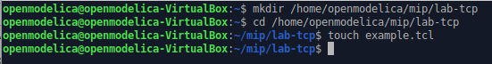{#fig:001 width=70%}

## Выполнение лабораторной работы

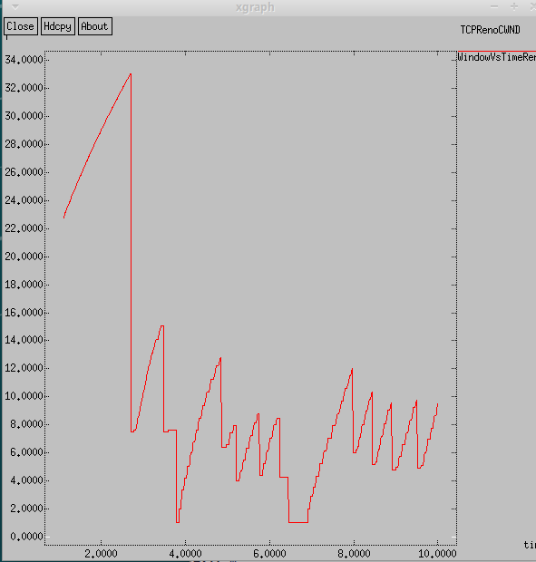{#fig:002 width=70%}

## Выполнение лабораторной работы

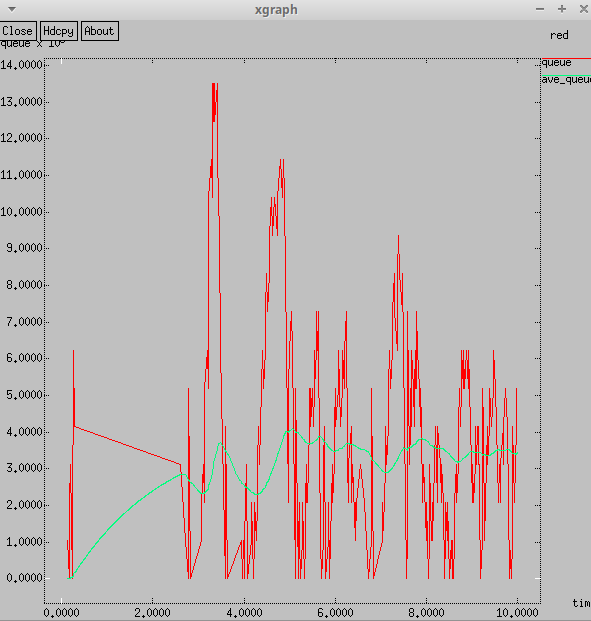{#fig:003 width=70%}

## Выполнение лабораторной работы

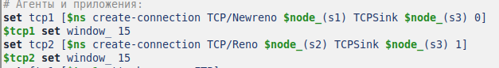{#fig:007 width=70%}

## Выполнение лабораторной работы

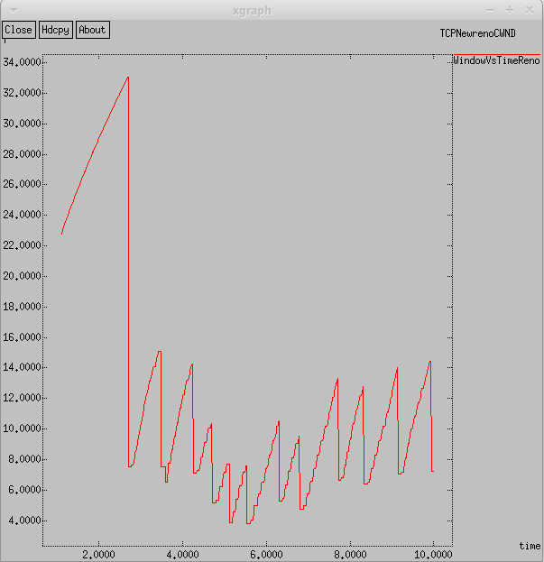{#fig:015 width=70%}

## Выполнение лабораторной работы

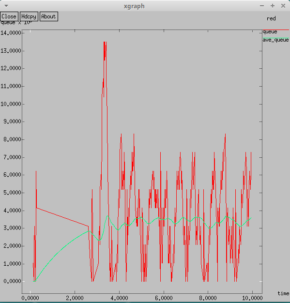{#fig:008 width=70%}

## Выполнение лабораторной работы

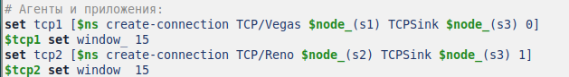{#fig:009 width=70%}

## Выполнение лабораторной работы

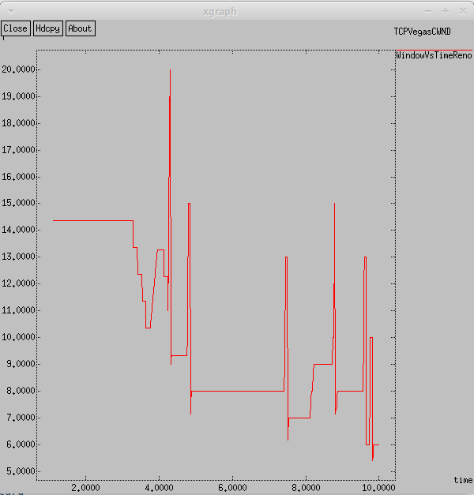{#fig:016 width=70%}

## Выполнение лабораторной работы

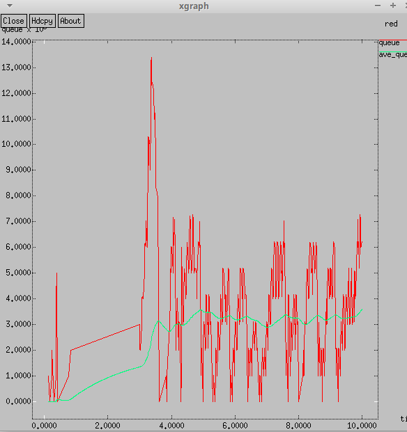{#fig:010 width=70%}

## Выполнение лабораторной работы

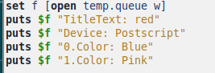{#fig:011 width=70%}

## Выполнение лабораторной работы

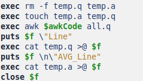{#fig:012 width=70%}

## Выполнение лабораторной работы

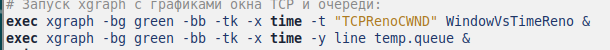{#fig:013 width=70%}

## Выполнение лабораторной работы

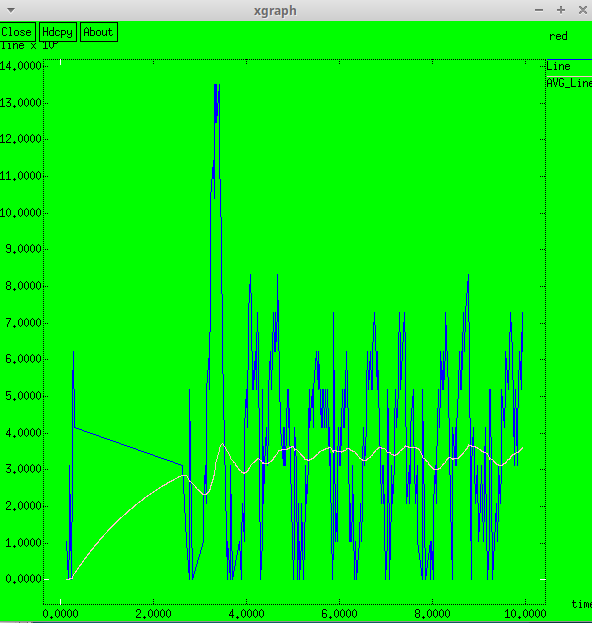{#fig:014 width=70%}

## Выводы

Я ознакомилась с протоколом TCP и алгоритмом управления очередью RED, приобрела практические навыки использования.

##

Спасибо за внимание!

