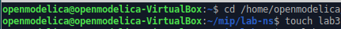
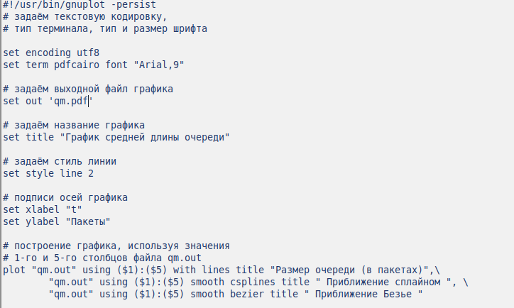
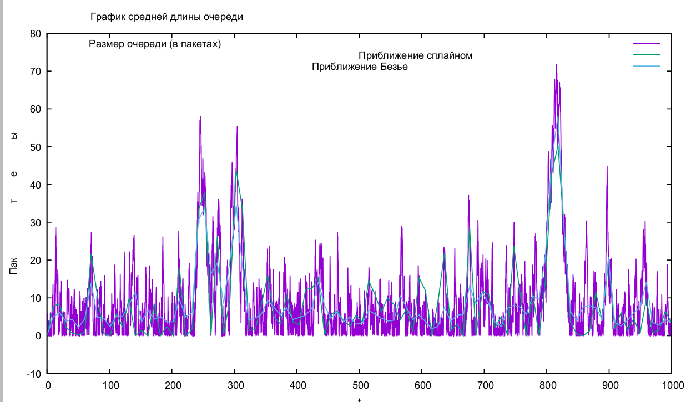

---
## Front matter
lang: ru-RU
title: Лабораторная работа №3
subtitle: Имитационное моделирование
author:
  - Серёгина Ирина Андреевна
institute:
  - Российский университет дружбы народов, Москва, Россия
date: 19 февраля 2025

## i18n babel
babel-lang: russian
babel-otherlangs: english

## Formatting pdf
toc: false
toc-title: Содержание
slide_level: 2
aspectratio: 169
section-titles: true
theme: metropolis
header-includes:
 - \metroset{progressbar=frametitle,sectionpage=progressbar,numbering=fraction}
---

## Цель работы

Смоделировать систему массового обслуживания (СМО).

## Задание

1. Реализация модели *M|M|1*
2. Подсчитать вероятность потери пакетов и загрузку системы
3. Построить график изменения размера очереди

## Теоретическое введение

M |M |1 — однолинейная СМО с накопителем бесконечной ёмкости. Поступающий поток заявок — пуассоновский с интенсивностью λ. Времена обслуживания
заявок — независимые в совокупности случайные величины, распределённые по
экспоненциальному закону с параметром μ. 

## Выполнение лабораторной работы

{#fig:001 width=70%}

## Выполнение лабораторной работы

{#fig:002 width=70%}

## Выполнение лабораторной работы

{#fig:003 width=70%}

## Выполнение лабораторной работы

{#fig:004 width=70%}

## Выполнение лабораторной работы

{#fig:005 width=70%}

## Выводы

Я смоделировала систему массового обслуживания

##

Спасибо за внимание!!
