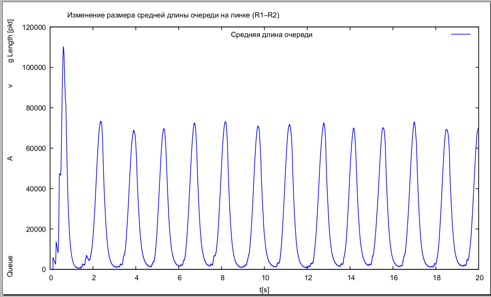

---
## Front matter
lang: ru-RU
title: Лабораторная работа №4
subtitle: Имитационное моделирование
author:
  - Серёгина Ирина Андреевна
institute:
  - Российский университет дружбы народов, Москва, Россия
date: 27 февраля 2025

## i18n babel
babel-lang: russian
babel-otherlangs: english

## Formatting pdf
toc: false
toc-title: Содержание
slide_level: 2
aspectratio: 169
section-titles: true
theme: metropolis
header-includes:
 - \metroset{progressbar=frametitle,sectionpage=progressbar,numbering=fraction}
---

## Цель работы

Выполнить задание для самостоятельного выполнения

## Задание

1. Для приведённой схемы разработать имитационную модель в пакете NS-2.
2. Построить график изменения размера окна TCP (в Xgraph и в GNUPlot);
3. Построить график изменения длины очереди и средней длины очереди на первом
маршрутизаторе.

## Выполнение лабораторной работы

{#fig:001 width=70%}

## Выполнение лабораторной работы

{#fig:002 width=70%}

## Выполнение лабораторной работы

{#fig:003 width=70%}

## Выполнение лабораторной работы

{#fig:004 width=70%}

## Выполнение лабораторной работы

{#fig:005 width=70%}

## Выполнение лабораторной работы

{#fig:006 width=70%}

## Выполнение лабораторной работы

{#fig:007 width=70%}

## Выполнение лабораторной работы

{#fig:008 width=70%}

## Выводы

Я выполнила задание для самостоятельного выполнения.

##

Спасибо за внимание!

