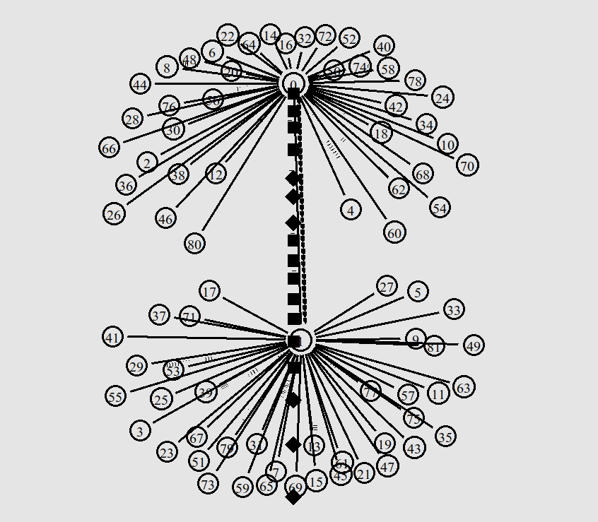
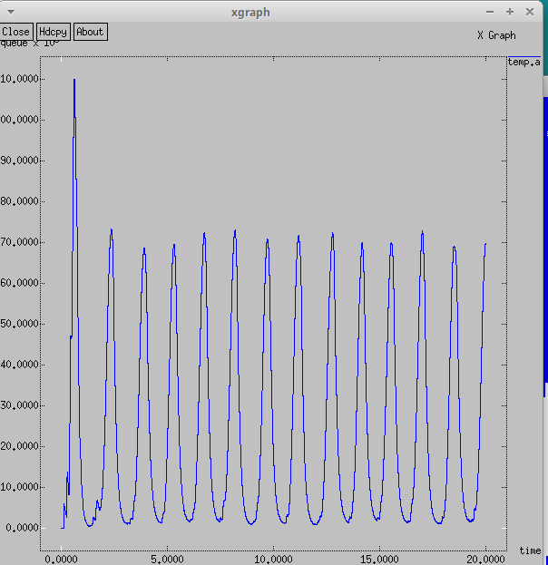
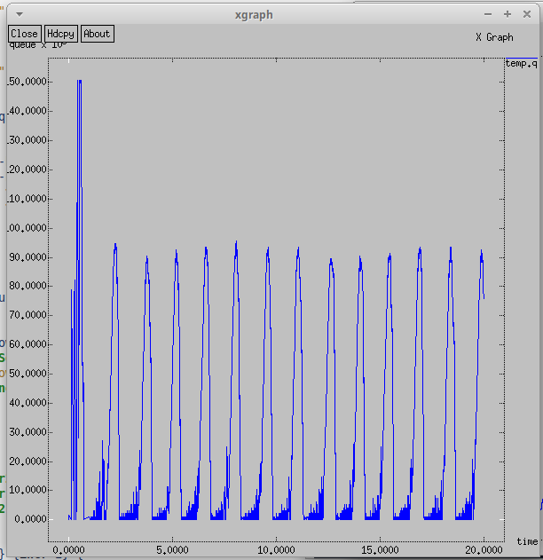
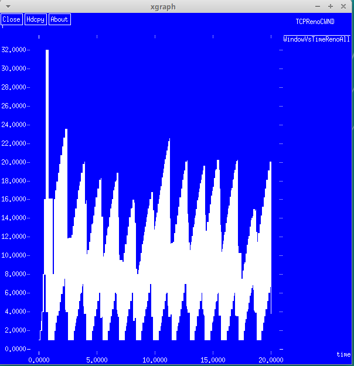
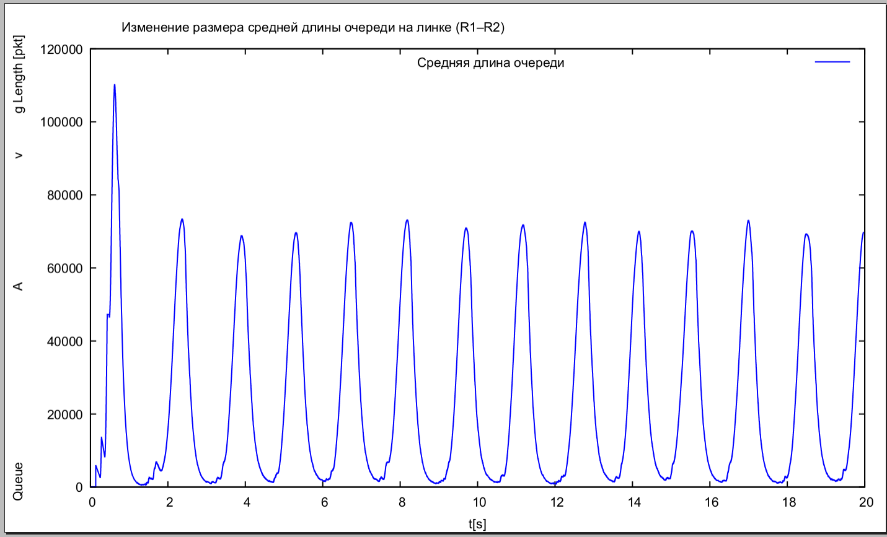
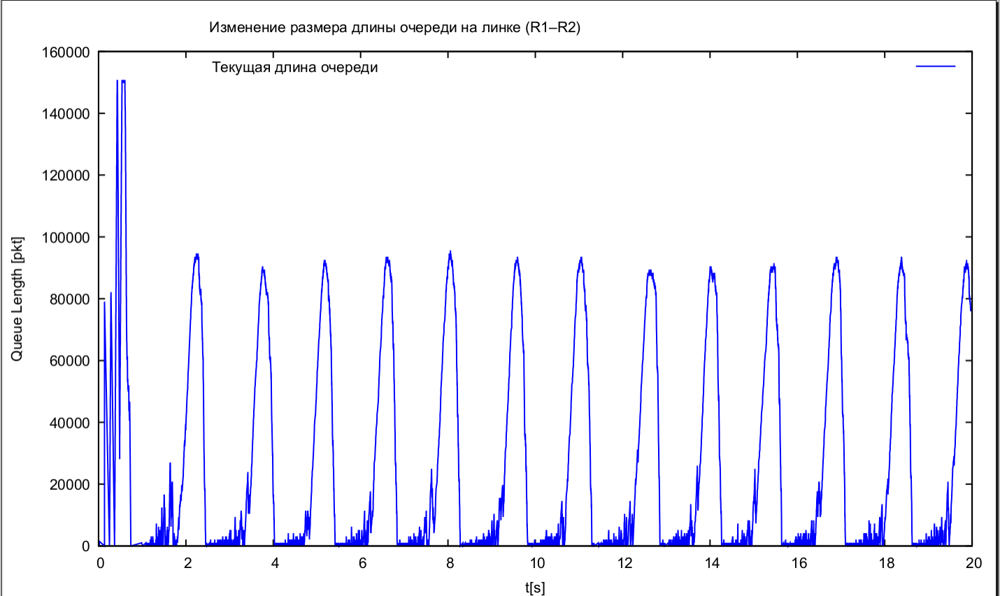
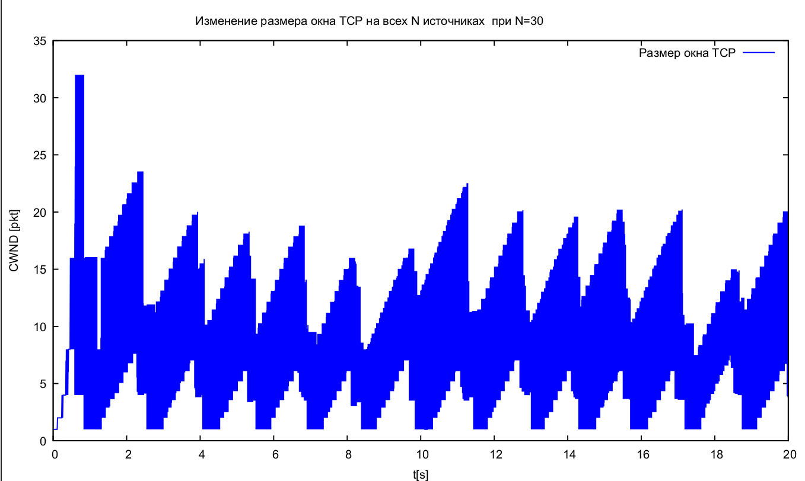
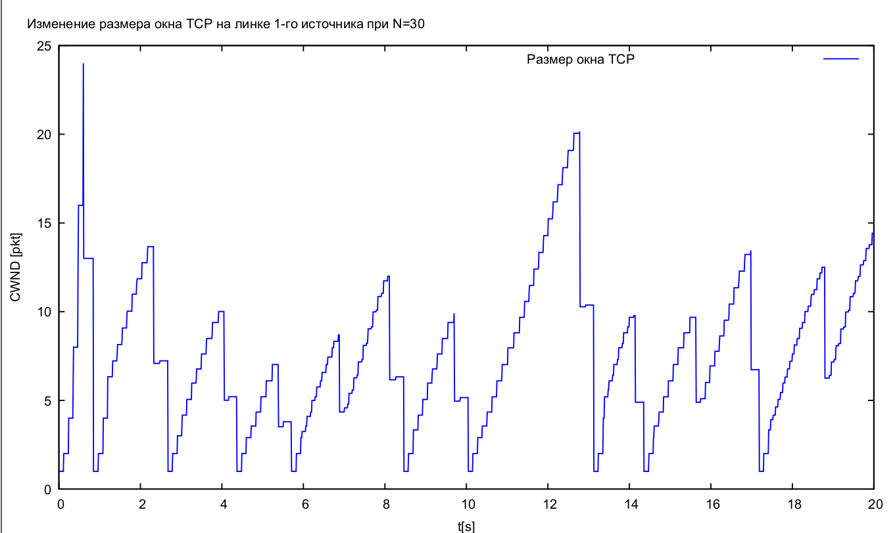

---
## Front matter
title: "Лабораторная работа №4"
subtitle: "Имитационное моделирование"
author: "Серёгина Ирина Андреевна"

## Generic otions
lang: ru-RU
toc-title: "Содержание"

## Bibliography
bibliography: bib/cite.bib
csl: pandoc/csl/gost-r-7-0-5-2008-numeric.csl

## Pdf output format
toc: true # Table of contents
toc-depth: 2
lof: true # List of figures
lot: true # List of tables
fontsize: 12pt
linestretch: 1.5
papersize: a4
documentclass: scrreprt
## I18n polyglossia
polyglossia-lang:
  name: russian
  options:
	- spelling=modern
	- babelshorthands=true
polyglossia-otherlangs:
  name: english
## I18n babel
babel-lang: russian
babel-otherlangs: english
## Fonts
mainfont: IBM Plex Serif
romanfont: IBM Plex Serif
sansfont: IBM Plex Sans
monofont: IBM Plex Mono
mathfont: STIX Two Math
mainfontoptions: Ligatures=Common,Ligatures=TeX,Scale=0.94
romanfontoptions: Ligatures=Common,Ligatures=TeX,Scale=0.94
sansfontoptions: Ligatures=Common,Ligatures=TeX,Scale=MatchLowercase,Scale=0.94
monofontoptions: Scale=MatchLowercase,Scale=0.94,FakeStretch=0.9
mathfontoptions:
## Biblatex
biblatex: true
biblio-style: "gost-numeric"
biblatexoptions:
  - parentracker=true
  - backend=biber
  - hyperref=auto
  - language=auto
  - autolang=other*
  - citestyle=gost-numeric
## Pandoc-crossref LaTeX customization
figureTitle: "Рис."
tableTitle: "Таблица"
listingTitle: "Листинг"
lofTitle: "Список иллюстраций"
lotTitle: "Список таблиц"
lolTitle: "Листинги"
## Misc options
indent: true
header-includes:
  - \usepackage{indentfirst}
  - \usepackage{float} # keep figures where there are in the text
  - \floatplacement{figure}{H} # keep figures where there are in the text
---

# Цель работы

Выполнить задание для самостоятельного выполнения

# Задание

1. Для приведённой схемы разработать имитационную модель в пакете NS-2.
2. Построить график изменения размера окна TCP (в Xgraph и в GNUPlot);
3. Построить график изменения длины очереди и средней длины очереди на первом
маршрутизаторе.

# Выполнение лабораторной работы

К заданию для самостоятельного выполнения были даны следующие требования:
– сеть состоит из N TCP-источников, N TCP-приёмников, двух маршрутизаторов
R1 и R2 между источниками и приёмниками (N — не менее 20);
– между TCP-источниками и первым маршрутизатором установлены дуплексные
соединения с пропускной способностью 100 Мбит/с и задержкой 20 мс очередью
типа DropTail;
– между TCP-приёмниками и вторым маршрутизатором установлены дуплексные
соединения с пропускной способностью 100 Мбит/с и задержкой 20 мс очередью
типа DropTail;
– между маршрутизаторами установлено симплексное соединение (R1–R2) с про-
пускной способностью 20 Мбит/с и задержкой 15 мс очередью типа RED,
размером буфера 300 пакетов; в обратную сторону — симплексное соедине-
ние (R2–R1) с пропускной способностью 15 Мбит/с и задержкой 20 мс очередью
типа DropTail;
– данные передаются по протоколу FTP поверх TCPReno;
– параметры алгоритма RED: qmin = 75, qmax = 150, qw = 0, 002, pmax = 0.1;
– максимальный размер TCP-окна 32; размер передаваемого пакета 500 байт; время
моделирования — не менее 20 единиц модельного времени.

Листинг программы, соответствующей требованиям:

```
set ns [new Simulator]
 
set nf [open out.nam w]
 
$ns namtrace-all $nf
 
set f [open out.tr w]
 
$ns trace-all $f
 
Agent/TCP set window_ 32
Agent/TCP set pktSize_ 500
 
proc finish {} {
  global tchan_
  set awkCode {
  {
    if ($1 == "Q" && NF>2) {
      print $2, $3 >> "temp.q";
      set end $2
  }
    else if ($1 == "a" && NF>2)
      print $2, $3 >> "temp.a";
  }
}
 
exec rm -f temp.q temp.a
exec touch temp.a temp.q
 
set f [open temp.q w]
puts $f "0.Color: Blue"
close $f
 
set f [open temp.a w]
puts $f "0.Color: Blue"
close $f
 
exec awk $awkCode all.q
 
exec xgraph -fg white -bg blue -bb -tk -x time -t "TCPRenoCWND" WindowVsTimeRenoOne &
exec xgraph -fg white -bg blue B-bb -tk -x time -t "TCPRenoCWND" WindowVsTimeRenoAll &
exec xgraph -bb -tk -x time -y queue temp.q &
exec xgraph -bb -tk -x time -y queue temp.a &
exec nam out.nam &
exit 0
}
 
proc plotWindow {tcpSource file} {
  global ns
  set time 0.01
  set now [$ns now]
  set cwnd [$tcpSource set cwnd_]
  puts $file "$now $cwnd"
  $ns at [expr $now+$time] "plotWindow $tcpSource $file"
}
 
set r1 [$ns node]
set r2 [$ns node]
 
$ns simplex-link $r1 $r2 20Mb 15ms RED
$ns simplex-link $r2 $r1 15Mb 20ms DropTail
$ns queue-limit $r1 $r2 300
 
set N 40
for {set i 0} {$i < $N} {incr i} {
  set n1($i) [$ns node]
  $ns duplex-link $n1($i) $r1 100Mb 20ms DropTail
  set n2($i) [$ns node]
  $ns duplex-link $n2($i) $r2 100Mb 20ms DropTail
 
  set tcp($i) [$ns create-connection TCP/Reno $n1($i) TCPSink $n2($i) $i]
  set ftp($i) [$tcp($i) attach-source FTP]
}
 
set windowVsTimeOne [open WindowVsTimeRenoOne w]
puts $windowVsTimeOne "0.Color: White"
set windowVsTimeAll [open WindowVsTimeRenoAll w]
puts $windowVsTimeAll "0.Color: White"
 
set qmon [$ns monitor-queue $r1 $r2 [open qm.out w] 0.1];
[$ns link $r1 $r2] queue-sample-timeout;
 
set redq [[$ns link $r1 $r2] queue]
$redq set thresh_ 75
$redq set maxthresh_ 150
$redq set q_weight_ 0.002
$redq set linterm_ 10
 
set tchan_ [open all.q w]
$redq trace curq_
$redq trace ave_
$redq attach $tchan_
 
for {set i 0} {$i < $N} {incr i} {
  $ns at 0.0 "$ftp($i) start"
  $ns at 0.0 "plotWindow $tcp($i) $windowVsTimeAll"
}
 
$ns at 0.0 "plotWindow $tcp(1) $windowVsTimeOne"
 
$ns at 20.0 "finish"
 
$ns run
```

После запуска кода видим схему моделируемой сети (рис. [-@fig:001]).

{#fig:001 width=70%}

Так же видим построенные с помощью xgraph графики. Изменение размера средней длины очереди на линке R1-R2 (рис. [-@fig:002]), а также изменение длины очереди на линке R1-R2 (рис. [-@fig:002]).

{#fig:002 width=70%}

{#fig:003 width=70%}

Ещё получили график изменения окна TCP на всех источниках (рис. [-@fig:004]).

{#fig:004 width=70%}

Ниже представлен листинг для построения графиков с помощью GNUplot. 

```
#!/usr/bin/gnuplot -persist
# задаём текстовую кодировку,
# тип терминала, тип и размер шрифта
 
set encoding utf8
set term pdfcairo font "Arial,9"
 
# задаём выходной файл графика
 
set out 'TCP1.pdf'
 
# задаём название графика
 
set title "Изменение размера окна TCP на линке 1-го источника при N=30"
 
# подписи осей графика
 
set xlabel "t[s]" font "Arial,9"
set ylabel "CWND [pkt]" font "Arial,9"
 
# построение графика, используя значения
# 1-го и 2-го столбцов файла WindowVsTimeRenoOne
 
plot "WindowVsTimeRenoOne" using ($1):($2) with lines lc rgb "#0000ff" title "Размер окна TCP"
 
# задаём выходной файл графика
 
set out 'TCPall.pdf'
 
# задаём название графика
 
set title "Изменение размера окна TCP на всех N источниках  при N=30"
 
# построение графика, используя значения
# 1-го и 2-го столбцов файла WindowVsTimeRenoAll
 
plot "WindowVsTimeRenoAll" using ($1):($2) with lines lc rgb "#0000ff" title "Размер окна TCP"
 
# задаём выходной файл графика
 
set out 'queue.pdf'
 
# задаём название графика
 
set title "Изменение размера длины очереди на линке (R1–R2)"
 
# подписи осей графика
 
set xlabel "t[s]" font "Arial,9"
set ylabel "Queue Length [pkt]" font "Arial,9"
 
# построение графика, используя значения
# 1-го и 2-го столбцов файла temp.q
 
plot "temp.q" using ($1):($2) with lines lc rgb "#0000ff" title "Текущая длина очереди"
 
# задаём выходной файл графика
 
set out 'avg_queue.pdf'
 
# задаём название графика
 
set title "Изменение размера средней длины очереди на линке (R1–R2)"
 
# подписи осей графика
 
set xlabel "t[s]" font "Arial,9"
set ylabel "Queue Avg Length [pkt]" font "Arial,9"
 
# построение графика, используя значения
# 1-го и 2-го столбцов файла temp.a
 
plot "temp.a" using ($1):($2) with lines lc rgb "#0000ff" title "Средняя длина очереди"
 
```

После запуска программы получили 4 графика. Изменение размера средней длины очереди на линке R1-R2 (рис. [-@fig:005]), а также изменение длины очереди на линке R1-R2 (рис. [-@fig:006]).

{#fig:005 width=70%}

{#fig:006 width=70%}

А также графики изменения размера окна TCP на всех источниках (рис. [-@fig:007]) и на линке первого источника (рис. [-@fig:008]).

{#fig:007 width=70%}

{#fig:008 width=70%}

# Выводы

Я выполнила задание для самостоятельного выполнения.


