---
## Front matter
lang: ru-RU
title: Лабораторная работа №6
subtitle: Имитационное моделирование
author:
  - Серёгина Ирина Андреевна
institute:
  - Российский университет дружбы народов, Москва, Россия
date: 13 марта 2025

## i18n babel
babel-lang: russian
babel-otherlangs: english

## Formatting pdf
toc: false
toc-title: Содержание
slide_level: 2
aspectratio: 169
section-titles: true
theme: metropolis
header-includes:
 - \metroset{progressbar=frametitle,sectionpage=progressbar,numbering=fraction}
---

## Цель работы

Реализовать модель "хищник-жертва".

## Задание

1. Реализовать модель "хищник-жертва" в xcos.
2. Реализовать модель "хищник-жертва" с помощью блока Modelica.
3. Реализовать модель "хищник-жертва" с помощью OpenModelica.

## Выполнение лабораторной работы

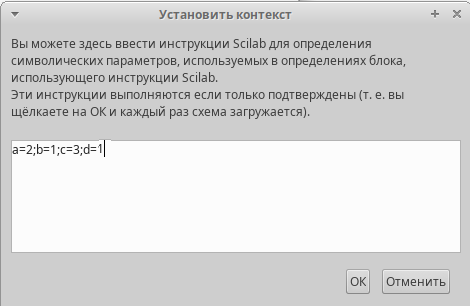{#fig:001 width=70%}

## Выполнение лабораторной работы

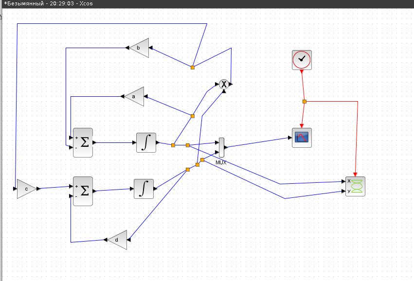{#fig:002 width=70%}

## Выполнение лабораторной работы

{#fig:003 width=70%}

## Выполнение лабораторной работы

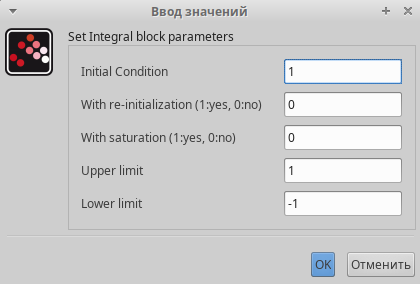{#fig:004 width=70%}

## Выполнение лабораторной работы

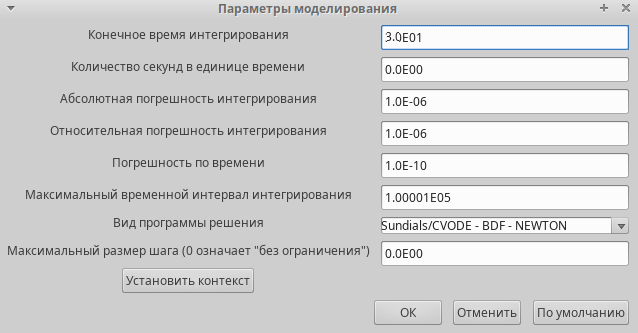{#fig:005 width=70%}

## Выполнение лабораторной работы

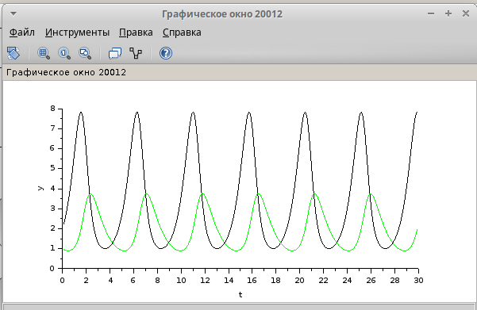{#fig:006 width=70%}

## Выполнение лабораторной работы

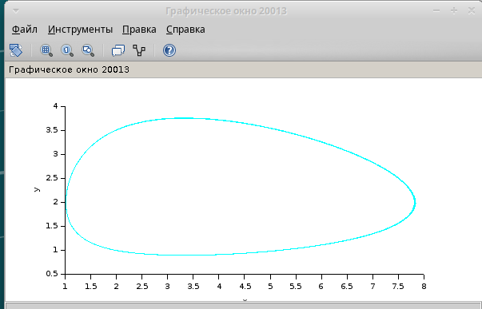{#fig:007 width=70%}

## Выполнение лабораторной работы

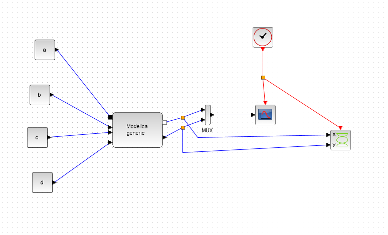{#fig:008 width=70%}

## Выполнение лабораторной работы

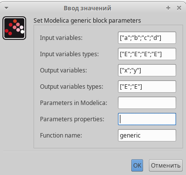{#fig:009 width=70%}

## Выполнение лабораторной работы

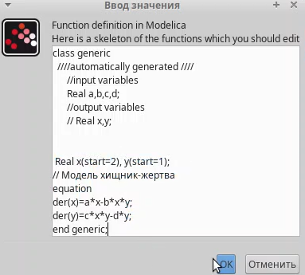{#fig:010 width=70%}

## Выполнение лабораторной работы

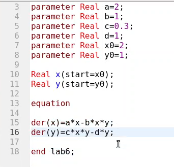{#fig:011 width=70%}

## Выполнение лабораторной работы

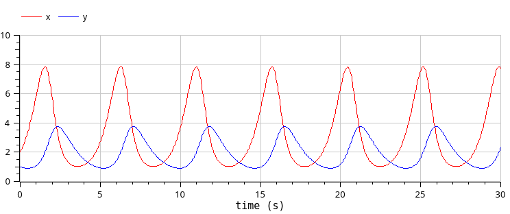{#fig:012 width=70%}

## Выполнение лабораторной работы

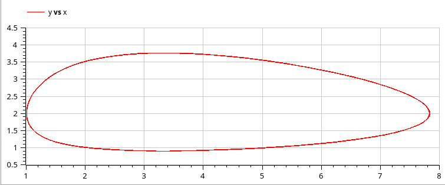{#fig:013 width=70%}

## Выводы

Я реализовала модель "хищник-жертва" различными способами.

## 

Спасибо за внимание!!
