---
## Front matter
title: "Лабораторная работа №6"
subtitle: "Имитационное моделирование"
author: "Серёгина Ирина Андреевна"

## Generic otions
lang: ru-RU
toc-title: "Содержание"

## Bibliography
bibliography: bib/cite.bib
csl: pandoc/csl/gost-r-7-0-5-2008-numeric.csl

## Pdf output format
toc: true # Table of contents
toc-depth: 2
lof: true # List of figures
lot: true # List of tables
fontsize: 12pt
linestretch: 1.5
papersize: a4
documentclass: scrreprt
## I18n polyglossia
polyglossia-lang:
  name: russian
  options:
	- spelling=modern
	- babelshorthands=true
polyglossia-otherlangs:
  name: english
## I18n babel
babel-lang: russian
babel-otherlangs: english
## Fonts
mainfont: IBM Plex Serif
romanfont: IBM Plex Serif
sansfont: IBM Plex Sans
monofont: IBM Plex Mono
mathfont: STIX Two Math
mainfontoptions: Ligatures=Common,Ligatures=TeX,Scale=0.94
romanfontoptions: Ligatures=Common,Ligatures=TeX,Scale=0.94
sansfontoptions: Ligatures=Common,Ligatures=TeX,Scale=MatchLowercase,Scale=0.94
monofontoptions: Scale=MatchLowercase,Scale=0.94,FakeStretch=0.9
mathfontoptions:
## Biblatex
biblatex: true
biblio-style: "gost-numeric"
biblatexoptions:
  - parentracker=true
  - backend=biber
  - hyperref=auto
  - language=auto
  - autolang=other*
  - citestyle=gost-numeric
## Pandoc-crossref LaTeX customization
figureTitle: "Рис."
tableTitle: "Таблица"
listingTitle: "Листинг"
lofTitle: "Список иллюстраций"
lotTitle: "Список таблиц"
lolTitle: "Листинги"
## Misc options
indent: true
header-includes:
  - \usepackage{indentfirst}
  - \usepackage{float} # keep figures where there are in the text
  - \floatplacement{figure}{H} # keep figures where there are in the text
---

# Цель работы

Реализовать модель "хищник-жертва".

# Задание

1. Реализовать модель "хищник-жертва" в xcos.
2. Реализовать модель "хищник-жертва" с помощью блока Modelica.
3. Реализовать модель "хищник-жертва" с помощью OpenModelica.

# Теоретическое введение

Модель «хищник–жертва» (модель Лотки — Вольтерры) представляет собой модель
межвидовой конкуренции. В математической
форме модель имеет вид:

$$
\begin{cases}
  \dot x = ax - bxy \\
  \dot y = cxy - dy,
\end{cases}
$$

где $x$ — количество жертв; $y$ — количество хищников; $a, b, c, d$ — коэффициенты, отражающие взаимодействия между видами: $a$ — коэффициент рождаемости
жертв; $b$ — коэффициент убыли жертв; $c$ — коэффициент рождения хищников; $d$ —
коэффициент убыли хищников.,

# Выполнение лабораторной работы

Сначала задаю контекст для модели (рис. [-@fig:001]).

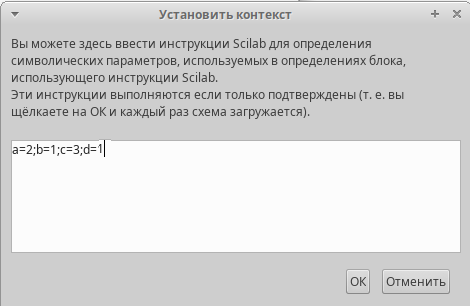{#fig:001 width=70%}

После этого строю модель с помощью уже знакомых блоков (рис. [-@fig:002]).

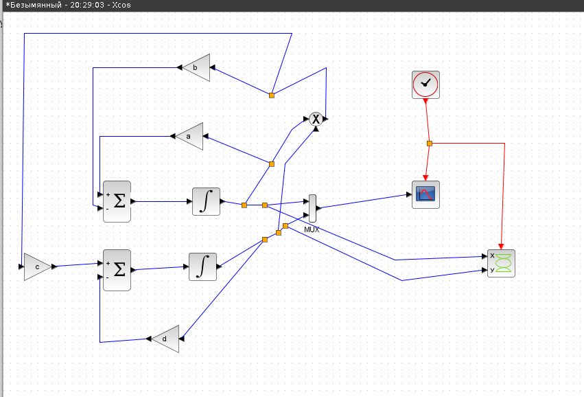{#fig:002 width=70%}

Задаю параметры для блоков интегрирования (рис. [-@fig:003]), (рис. [-@fig:004]).

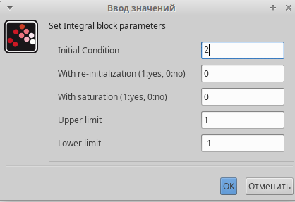{#fig:003 width=70%}

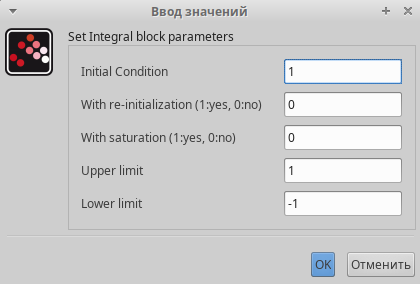{#fig:004 width=70%}

Меняю конечное время интегрирования на 30 секунд (рис. [-@fig:005]).

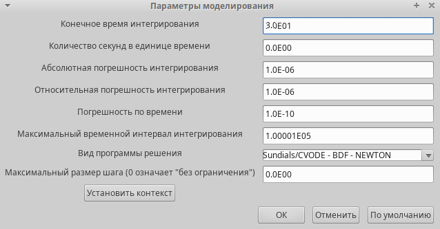{#fig:005 width=70%}

После запуска получаю два графика. Динамика изменения численности хищников и жертв модели (рис. [-@fig:006]).

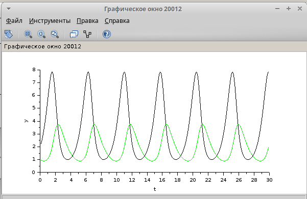{#fig:006 width=70%}

А также фазовый портрет модели (рис. [-@fig:007]).

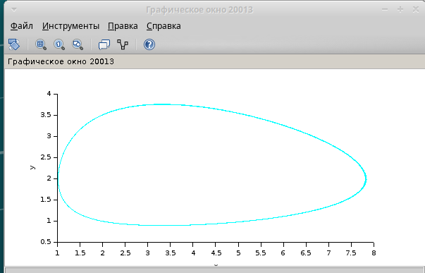{#fig:007 width=70%}

После этого строю модель с использованием блока Modelica. Задаю такой же контекст и конечное время интегрирования, строю схему (рис. [-@fig:008]).

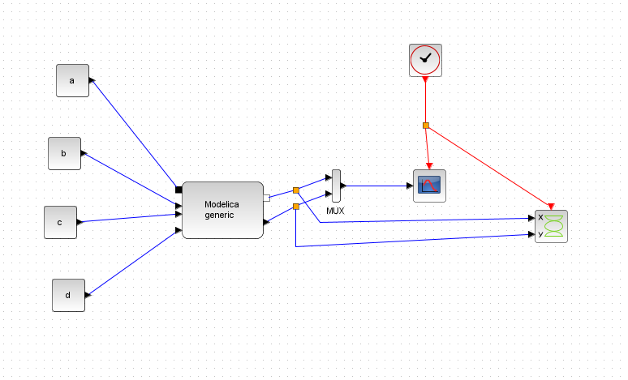{#fig:008 width=70%}

Настраиваю блок Modelica (рис. [-@fig:009]), рис. [-@fig:010]).

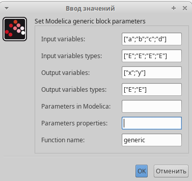{#fig:009 width=70%}

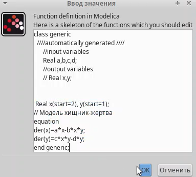{#fig:010 width=70%}

После этого получаю два графика, идентичных предыдущим.

Запускаю программу ONEdit, чтобы реализовать модель с помощью OpenModelica, пишу код (рис. [-@fig:011]).

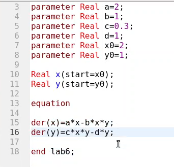{#fig:011 width=70%}

Получаю график динамики изменения численности хищников и жертв модели (рис. [-@fig:012]).

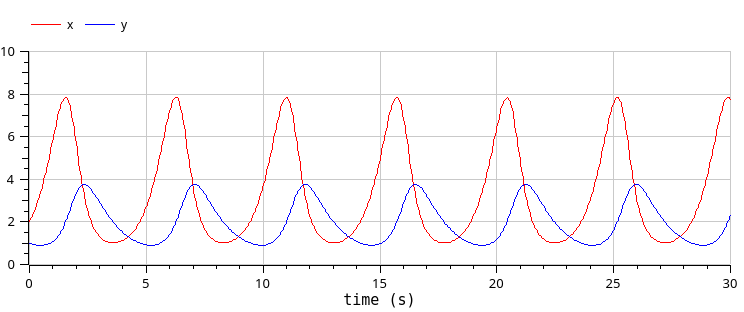{#fig:012 width=70%}

А также фазовый портрет модели (рис. [-@fig:013]).

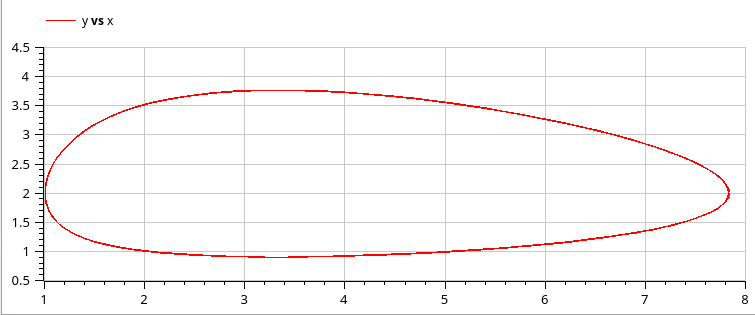{#fig:013 width=70%}

# Выводы

Я реализовала модель "хищник-жертва" различными способами.
