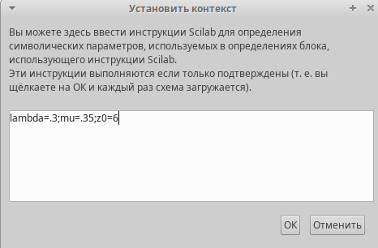
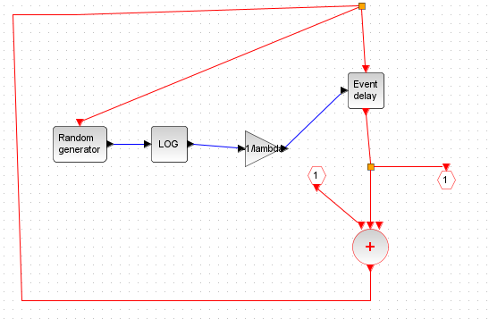
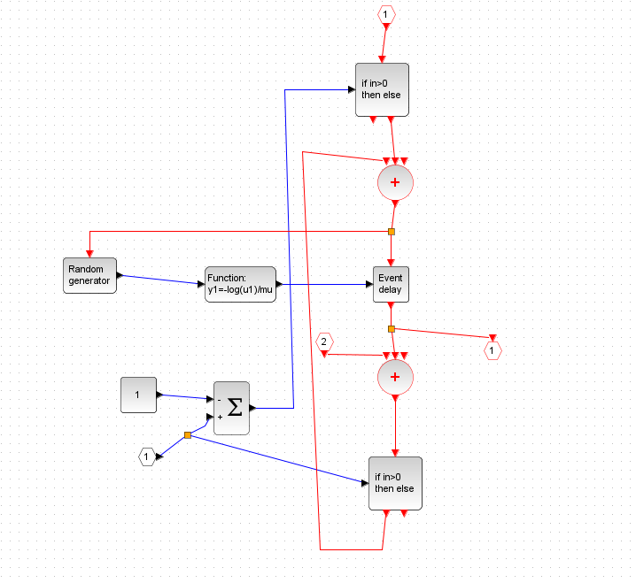
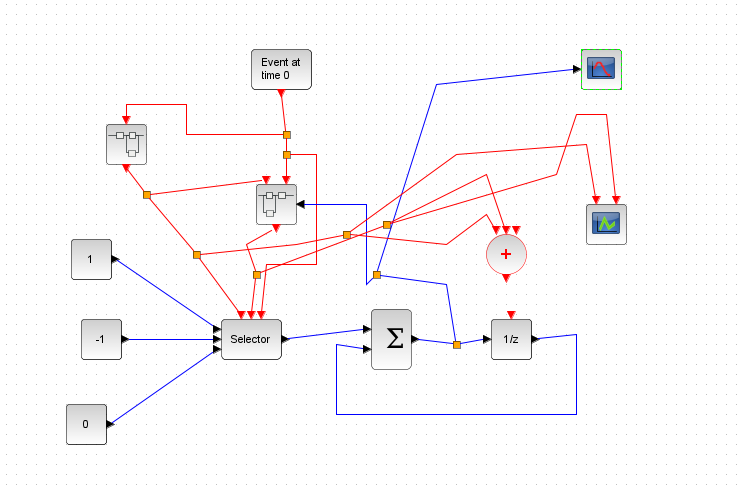
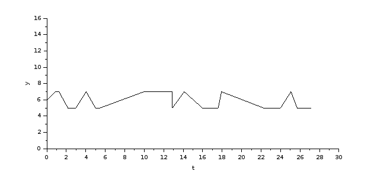
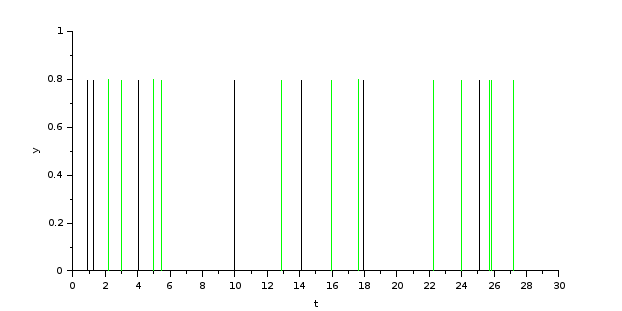

---
## Front matter
lang: ru-RU
title: Лабораторная работа №7
subtitle: Имитационное моделирование
author:
  - Серёгина Ирина Андреевна
institute:
  - Российский университет дружбы народов, Москва, Россия
date: 22 марта 2025

## i18n babel
babel-lang: russian
babel-otherlangs: english

## Formatting pdf
toc: false
toc-title: Содержание
slide_level: 2
aspectratio: 169
section-titles: true
theme: metropolis
header-includes:
 - \metroset{progressbar=frametitle,sectionpage=progressbar,numbering=fraction}
---

## Цель работы

Смоделировать систему массового обслуживания типа M|M|1|inf в xcos.

## Задание

1. Реализовать модель системы массового обслуживания типа M|M|1|inf
2. Построить график динамики размера очереди 
3. Построить график поступления и обработки заявок

## Выполнение лабораторной работы

{#fig:001 width=70%}

## Выполнение лабораторной работы

{#fig:002 width=70%}

## Выполнение лабораторной работы

{#fig:003 width=70%}

## Выполнение лабораторной работы

{#fig:004 width=70%}

## Выполнение лабораторной работы

{#fig:005 width=70%}

## Выполнение лабораторной работы

{#fig:006 width=70%}

## Выводы

Я смоделировала систему массового обслуживания типа M|M|1|inf в xcos.

## 

Спасибо за внимание!

